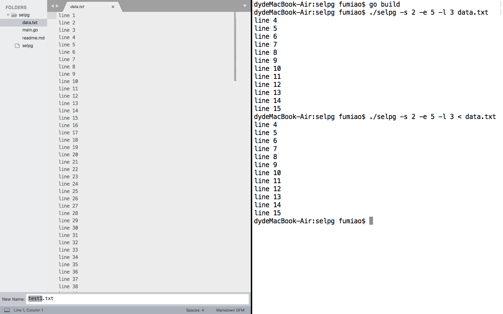
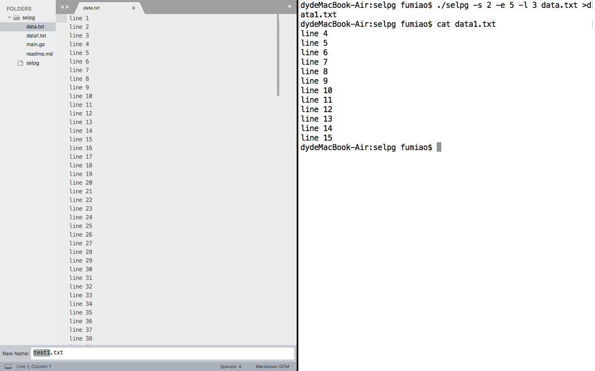
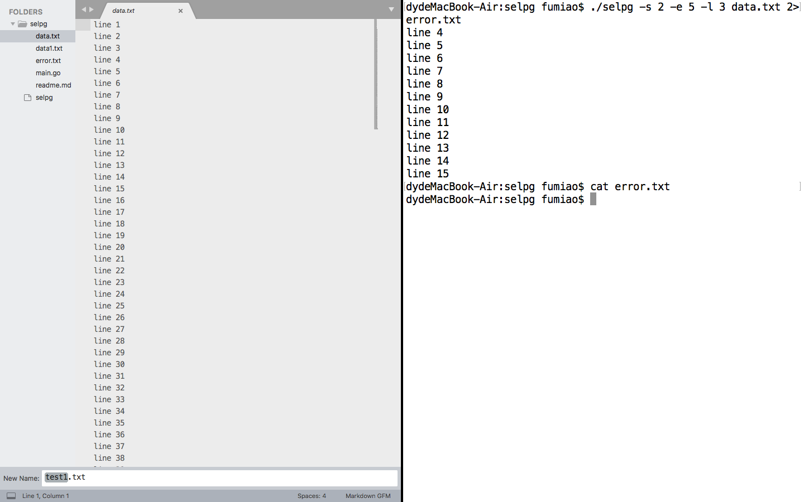
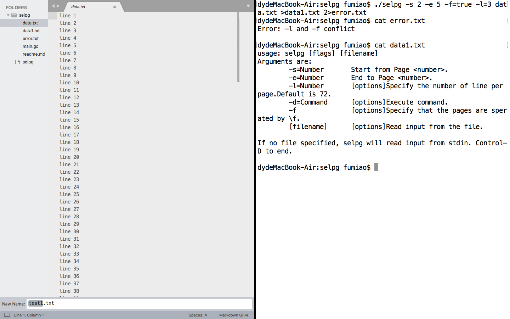
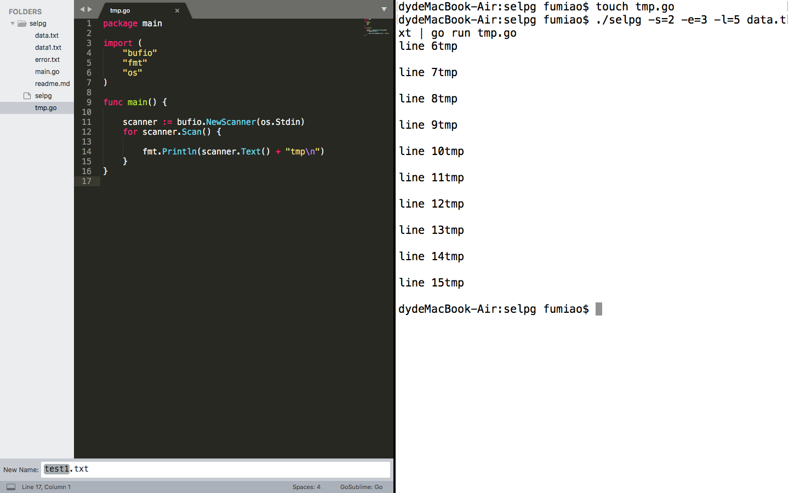
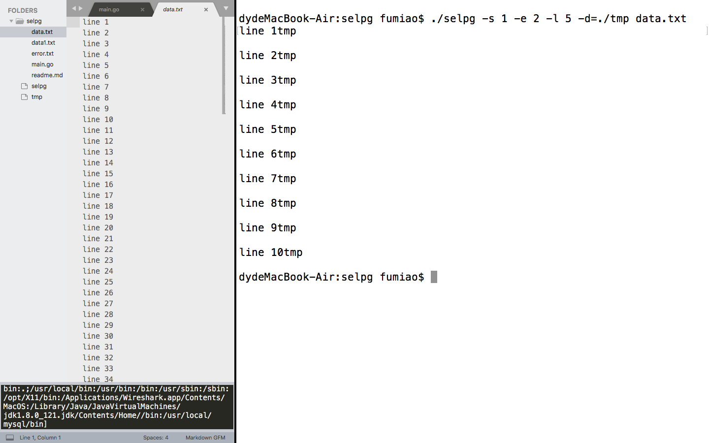
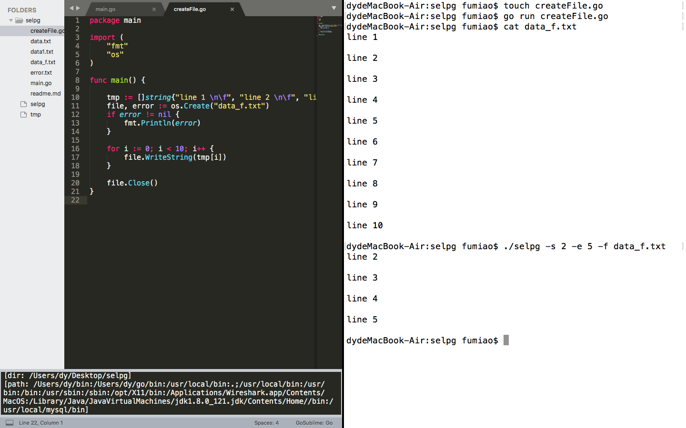

# selpg


自定义Linux命令行使用程序

selpg允许用户从输入文本中抽取一定范围的页，这些输入文本可以来自标准输入，文件或另一个进程。页的范围由起始页和终止页决定。在管道中，输入输出和错误流重定向的情况下也可使用该工具。


### Usage
```
$ ./selpg -h

usage: selpg [flags] [filename]
Arguments are:
    -s=Number   Start from Page <number>.
    -e=Number   End to Page <number>.
    -l=Number   [options]Specify the number of line per page.Default is 72.
    -d=Command  [options]Execute command.
    -f          [options]Specify that the pages are sperated by \f.
    [filename]  [options]Read input from the file.

If no file specified, selpg will read input from stdin. Control-D to end.
```


### Design


代码使用GO实现。`main`主要包含2个函数：

`argsProcess(&args)`   //处理参数部分
`inputProcess(&args)`  //处理输入输出部分


Args是一个结构体，用于储存命令行的所有参数：

```
type Args struct {
    pragrom_name      string
    start_page        int
    end_page          int
    page_length       int
    page_type         bool      //true :'-f'
    input_file        string
    print_destination string
}
```

`argsProcess(args *Args)`

- 主要完成两个任务（实现比较简单，直接参见代码）：
1.设置命令行参数使用标准
2.对参数进行逻辑判断和处理

`inputProcess(args *Args)`

- 主要任务
 负责根据命令和参数，进行输入输出操作。

函数伪代码如下：

```clike
if input_file 为空 then
    输入为标准输入
    if 页面以'\f'分隔 then
        readByPage()
    else then
        readByLine()
else than
    输入来自于文件input_file
    打开input_file，获取输入流
    if 页面以'\f'分隔 then
        readByPage()
    else then
        readByLine()
```

- 子模块
 分别实现按页按行处理输入
    `readByPage(inputReader *bufio.Reader, args *Args)`
    `readByLine(inputReader *bufio.Reader, args *Args)`


- 重点
对于管道问题，使用了 os/exec包来生成子进程并通过管道输入信息，这里给出部分代码
为了验证`-d`的功能，这里默认为会将`./tmp`程序作为`-d`的参数值。`./tmp`的作用是在每个输入的字符串后加上"tmp"。

```
cmd := exec.Command("./tmp")          // 创建命令"./tmp"
stdin, err := cmd.StdinPipe()    // 打开./tmp的标准输入管道
check(err)                            // 错误检测
stdin.Write([]byte(page + "\n")) // 向管道中写入文本
stdin.Close()                    // 关闭管道
cmd.Stdout = os.Stdout                // ./tmp将会输出到屏幕
cmd.Run()                             // 运行./tmp命令
```


### Test And Result

- 为了显示方便 下面的测试都带上`-l`参数,输入为标准输入等就自行测试

```
    $ ./selpg -s=2 -e=5 -l 3 data.txt
    $ ./selpg -s=2 -e=5 -l 3 < data.txt
```



    $ ./selpg -s=2 -e=5 -l 3 data.txt > data1.txt




    $ ./selpg -s=2 -e=5 -l 3 data.txt 2>error.txt




    $  ./selpg -s=2 -e=5 -f=true -l=3 data.txt > data1.txt 2>error.txt




    $  ./selpg -s=2 -e=3 -l=5 data.txt | go run tmp.go




    $ ./selpg -s 1 -e 2 -l 5 -d=./tmp data.txt



    $  ./selpg -s=2 -e=5 -l -f data_f.txt
